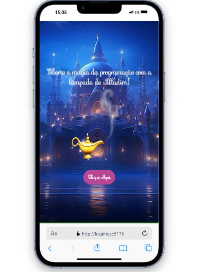
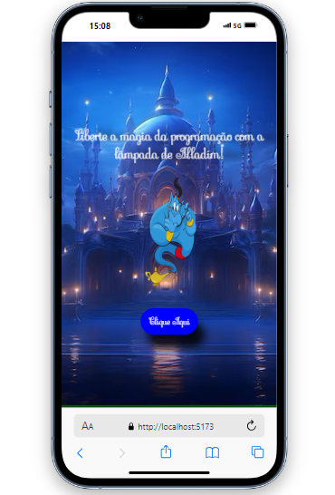

# Desafio Gênio da Lâmpada 💡
Projeto desenvolvido para os estudos de **React.js** e **Styled Components**. Foi criado como parte de um desafio de desenvolvimento frontend para o segundo módulo do curso de **Desenvolvimento FrontEnd do @VainaWeb**.

## Sobre o Projeto 🚀
O objetivo deste projeto foi praticar o gerenciamento de estados a componentes funcionais, com o uso do hook **useState**, bem como a construção de uma homepage totalmente responsiva utilizando **Styled Components** para a estilização e media queries para adaptação a diferentes tamanhos de tela.

### Tecnologias Utilizadas ✔️
- Javascript: Para criar a estrutura lógica da página.
- Styled-components: Para uma estilização mais dinâmica e de fácil manutenção.
- Media Queries: Para garantir que o design se adapte a diferentes tamanhos de tela.
- Figma: Referência de design fornecida pelo curso.

### Demonstração:

